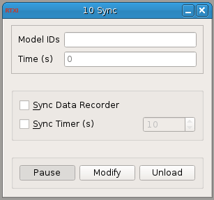

###Sync Module

**Requirements:** None  
**Limitations:** None  

<!--start-->
The Sync module is included in RTXI v1.3 by default. This module synchronizes the starting and stopping of a set of loaded modules. These modules must be derived from DefaultGUIModel. Enter the instance ID number of each module you want to synchronize in a comma-delimited list. This version of Synch has been updated to take a comma with or without an additional space. The instance ID number of a module is located in the left-hand corner of the title bar.
<!--end-->
